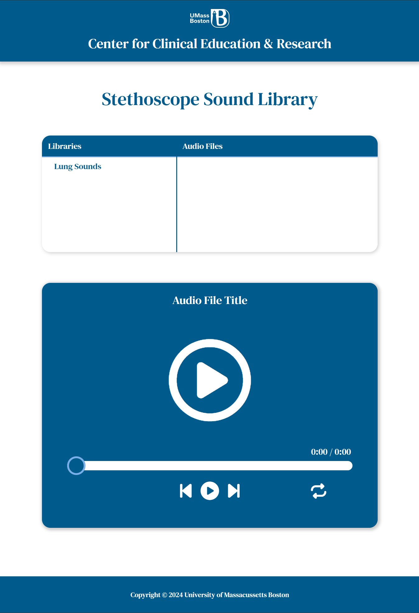
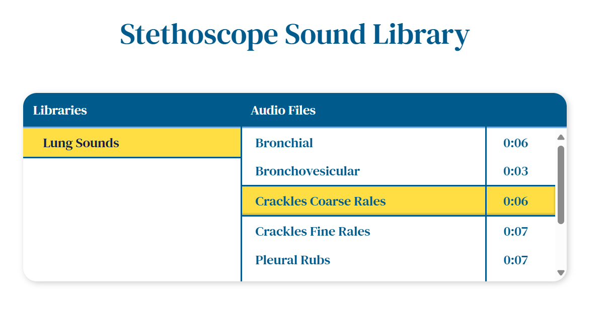
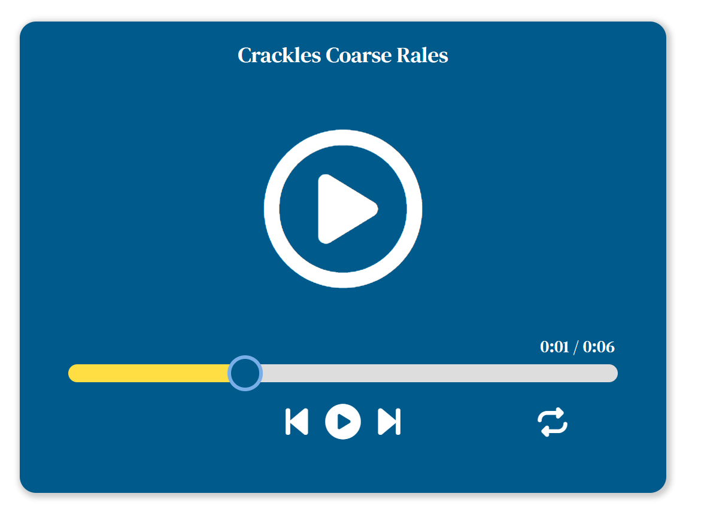
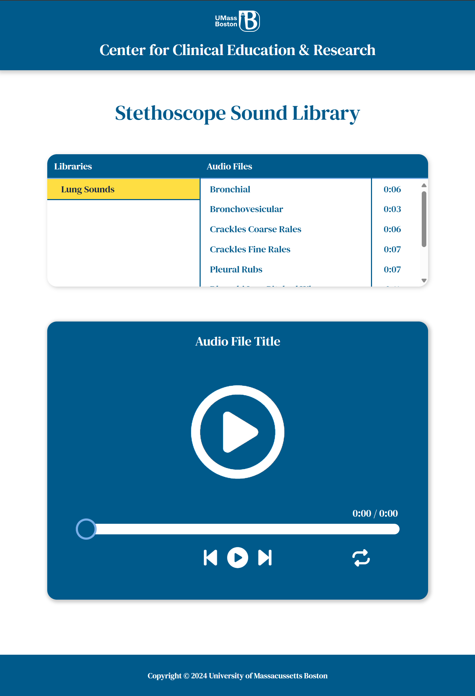
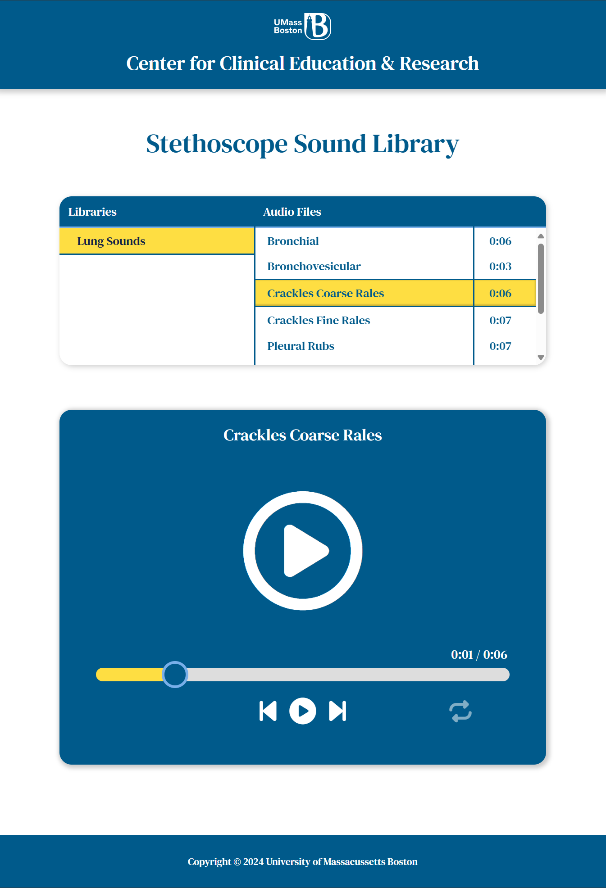

# Stethoscope Sound Library

I developed the Stethoscope Sound Library during my time as a student employee at the [Technovator](https://www.umb.edu/technovation/) (UMass Boston's Technology Innovation Incubator), which is part of the IT Educational Technology department at UMass Boston. This web-based audio system was specifically created for the [UMass Boston Center for Clinical Education & Research](https://www.umb.edu/nursing-health-sciences/departments-centers/center-clinical-education-research/) to provide nursing students with an intuitive, tablet-optimized interface for studying and practicing auscultation sounds.

## Overview

As the developer of this application, I focused on creating a structured learning environment that would enhance the auscultation training experience. The application includes a curated collection of sounds from [Practical Clinical Skills](https://www.practicalclinicalskills.com), a trusted resource for medical education content. Working closely with the Center for Clinical Education & Research, I designed the interface specifically for tablet devices, particularly iPads, to ensure easy access and seamless use in educational settings.

### Hardware Integration

While developing this application as a standalone software solution, I also collaborated with the [UMass Boston Makerspace](https://www.umb.edu/makerspace/) to integrate support for a custom Bluetooth-enabled stethoscope. This innovative device, which combines an existing stethoscope with 3D-printed components, can pair with any Bluetooth-capable device running the application. Through this hardware integration, I aimed to enhance the learning experience by creating a more immersive simulation that closely mirrors real clinical scenarios while maintaining the application's accessibility across various devices.

## System Architecture

The application uses a Flask backend with a vanilla JavaScript frontend, implementing a responsive design optimized for tablet devices. Key technical components include:

### Backend (Flask)

- **Caching System**: Implements Flask-Caching for optimized directory and file listing
- **Audio Processing**: Uses mutagen and pydub for audio file analysis
- **Security**: Path validation and HTTPS enforcement
- **File Serving**: Secure static file delivery with proper headers

### Frontend

- **Tablet-Optimized**: Interface designed specifically for iPad and similar devices
- **Touch-Friendly Controls**: Large, easily accessible buttons and controls
- **Responsive Design**: Adaptive layout that works across different tablet orientations
- **Audio API**: Leverages the Web Audio API for playback control
- **Bluetooth Integration**: Support for custom Bluetooth-enabled stethoscope hardware
- **Device Flexibility**: Functions both as standalone software and with specialized hardware

## Installation and Setup

### Prerequisites

```bash
Python 3.8+
pip (Python package installer)
Modern web browser with JavaScript enabled
```

### Installation Steps

1. Clone the repository:

   ```bash
   git clone [repository-url]
   cd stethoscope-sound-library
   ```

2. Create and activate a virtual environment:

   ```bash
   python -m venv venv
   # On Windows:
   .\venv\Scripts\activate
   # On Unix or MacOS:
   source venv/bin/activate
   ```

3. Install dependencies:

   ```bash
   pip install -r requirements.txt
   ```

4. Configure the application:
   - Create `cceraudio.ini` in the root directory
   - Add configuration:
     ```ini
     [settings]
     script_name = /your_path
     ```

### Running the Application

Development mode:

```bash
python app.py
```

The application will be available at `http://localhost:8000`

## Application Structure

### Core Components

```plaintext
├── app.py              # Flask application and routing
├── templates/
│   └── main.html      # Main application template
├── static/
│   ├── js/
│   │   └── scripts.js # Client-side functionality
│   └── css/
│       └── styles.css # Application styling
├── assets/
│   └── audio_files/   # Audio file storage with included sound files
└── requirements.txt   # Python dependencies
```

### Key Features and Implementation

#### Tablet-Optimized Features

- **Touch-Friendly Interface**: Large, easily tappable controls
- **Responsive Layout**: Adapts to both landscape and portrait orientations
- **Gesture Support**: Swipe and tap interactions for navigation
- **Optimized Typography**: Clear, readable text at various screen sizes

#### Backend Features

- **Directory Caching**: Implements a 5-minute cache for directory listings
- **Audio Duration Detection**: Dual-layer system using mutagen with pydub fallback
- **Security Measures**: Path traversal protection and input validation
- **Error Handling**: Comprehensive error states for file operations

#### Frontend Features

- **Dynamic Content Loading**: Asynchronous directory and file loading
- **Audio Controls**: Complete playback interface with progress tracking
- **State Management**: Tracks current directory, file, and playback status
- **Responsive Interface**: Adapts to different screen sizes and orientations

## Development Guidelines

### Adding New Features

1. Audio Format Support

   - Update supported formats in `app.py`
   - Test duration calculation
   - Verify playback compatibility

2. UI Modifications

   - Follow existing class naming conventions
   - Maintain mobile-first approach
   - Test across different viewport sizes

3. Backend Changes
   - Maintain caching strategy
   - Follow established security practices
   - Document new routes and functions

### Common Maintenance Tasks

#### Adding New Audio Files

1. Place files in appropriate subdirectory under `assets/audio_files/`
2. Supported formats: mp3, wav, aac, flac, ogg, m4a
3. Verify file permissions (readable by web server)

#### Modifying the Interface

1. Update relevant sections in `styles.css`
2. Test responsive breakpoints
3. Verify audio control functionality

#### Updating Cache Settings

1. Modify `CACHE_DEFAULT_TIMEOUT` in `app.py`
2. Clear existing cache when deploying changes

## Troubleshooting

### Common Issues

1. Audio Duration Not Detected

   - Verify file format compatibility
   - Check file permissions
   - Review error logs for specifics

2. Cache Not Updating

   - Clear Flask-Caching store
   - Verify cache timeout settings
   - Check file modification times

3. Playback Issues
   - Confirm browser compatibility
   - Verify file format support
   - Check browser console for errors

### Performance Optimization

1. Audio Files

   - Optimize file sizes
   - Use appropriate compression
   - Consider format conversion for compatibility

2. Caching

   - Adjust cache duration based on usage
   - Monitor cache hit rates
   - Consider implementing browser caching

3. Interface
   - Minimize DOM operations
   - Use efficient selectors
   - Implement lazy loading where appropriate

## Security Considerations

1. File Access

   - Maintain proper path validation
   - Verify file permissions
   - Monitor access logs

2. Input Validation

   - Sanitize directory and file names
   - Validate file types
   - Check file sizes

3. Network Security
   - Maintain HTTPS configuration
   - Update security headers
   - Monitor server logs

## Contributing

When contributing to this project:

1. Follow existing code style and conventions
2. Document new features and changes
3. Test on target devices (particularly iPads)
4. Update README with significant changes

## Attribution and Development

I created this application while working as a student employee at the [Technovator](https://www.umb.edu/technovation/), UMass Boston's Technology Innovation Incubator, under the IT Educational Technology department. The project was developed specifically for the [UMass Boston Center for Clinical Education & Research](https://www.umb.edu/nursing-health-sciences/departments-centers/center-clinical-education-research/) to enhance their medical education capabilities. All auscultation sounds included in this repository are sourced from [Practical Clinical Skills](https://www.practicalclinicalskills.com).

### Acknowledgments

I would like to express my gratitude to:

- The [Technovator](https://www.umb.edu/technovation/) for providing the resources and support necessary for this project
- The [UMass Boston Center for Clinical Education & Research](https://www.umb.edu/nursing-health-sciences/departments-centers/center-clinical-education-research/) for their guidance in understanding the educational requirements
- The [UMass Boston Makerspace](https://www.umb.edu/makerspace/) for their collaboration on the hardware integration
- [Practical Clinical Skills](https://www.practicalclinicalskills.com) for providing the high-quality auscultation sounds used in this application

## 📸 Screenshots







